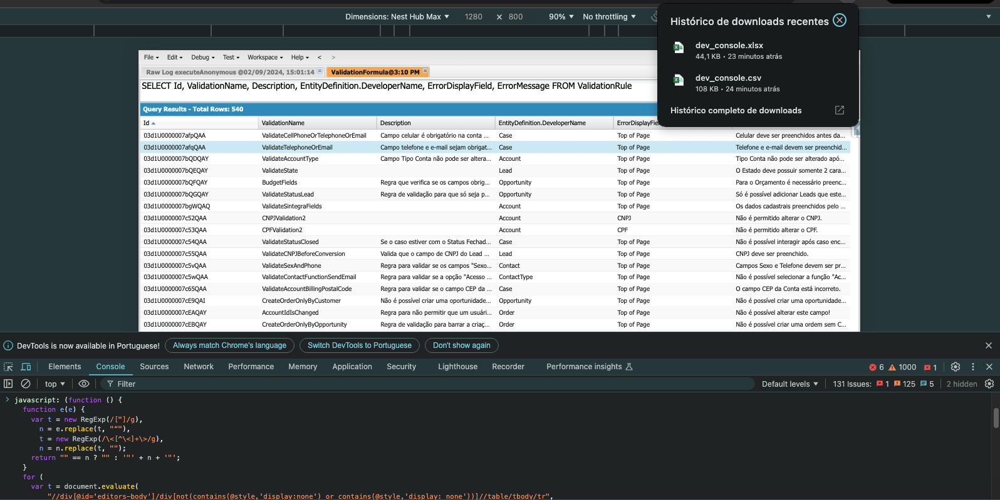

# Bookmark Salesforce

Uma solução rápida que funciona para quem precisa realizar exportações do console. O script abre uma nova janela com dados brutos em formato xlsx e um link para um arquivo xlsx para download. O script funciona no Chrome, não verifiquei em outros navegadores.

Cole o trecho do código main.js na aba console do inspect element na URL do seu developer console.

Com um clique, ele baixará os resultados do console em um arquivo excel.

## Demonstração

Preview de como executar o bookmark:

- Selecione a aba que deseja exportar (o script pega apenas a aba ativa).

- Pressione F12 (janela do Firebug) e vá para o console.

- Copie/cole o script a seguir e pressione enter. Não esqueça de permitir que uma janela apareça (o Chrome geralmente bloqueia).

[Get all validation rules from org](https://thecloudjedi.medium.com/get-all-validation-rules-into-a-spreadsheet-format-9ad090de5f3a)
[Export Results from developer console](https://salesforce.stackexchange.com/questions/15328/export-results-from-developer-console-query-editor)
